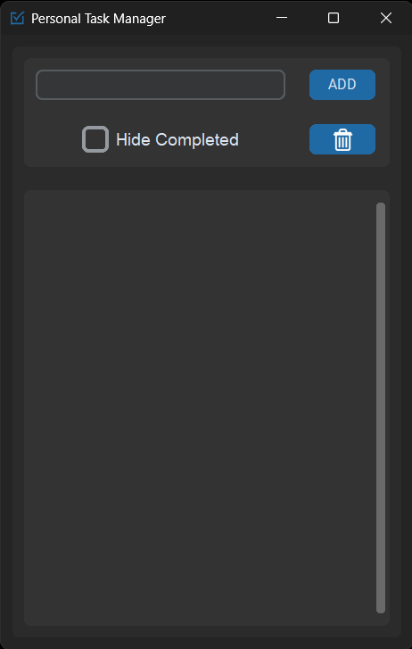
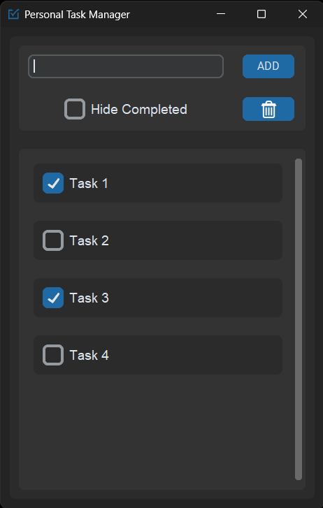
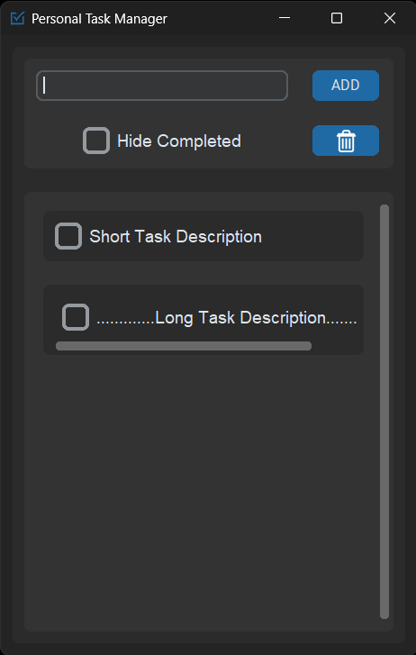

# Personal Task Manager

The Personal Task Manager is a Python-based task management application with a graphical user interface (GUI). It empowers users to effortlessly manage their tasks by adding, deleting, marking them as completed.

## Features

- Add tasks to the task list.
- Mark tasks as completed.
- Toggle between hiding and showing completed tasks.
- Delete all tasks and reset the application.

Tasks are automatically saved to the database when added, marked as completed, or undone. The task list will reload from the database when the application is restarted.

## Table of Contents

- [Dependencies](#dependencies)
- [Installation](#installation)
- [Usage](#usage)
- [How to Contribute](#how-to-contribute)
- [License](#license)
- [Screenshots](#screenshots)

## Dependencies

The application uses the following Python libraries:

- [customtkinter](https://pypi.org/project/customtkinter/): A custom Tkinter library for creating modern and attractive GUIs.
- [Pillow](https://pypi.org/project/Pillow/): Python Imaging Library for image handling.
- [PyMySQL](https://pypi.org/project/PyMySQL/): Python module for MySQL database connectivity.

## Installation

1. Clone the repository:

   ```bash
   git clone https://github.com/sanjai4334/task-manager.git
   ```

2. Open the directory in your terminal.

   ```bash
   cd task-manager
   ```

3. Install the dependencies:

   ```bash
   pip install -r requirements.txt
   ```

4. Download and setup [MySQL](https://dev.mysql.com/downloads/).

5. Edit the database connection credentials in `main.py`.

6. Run the application:

   ```bash
   python main.py
   ```

## Usage

The application provides a simple GUI for managing tasks:

- Type a task description into the input field and click the "ADD" button to add it to the list.
- Click the checkbox next to a task to mark it as completed.
- Click the "Hide Completed" checkbox to toggle between hiding and showing completed tasks.
- Click the trash can icon button to delete all tasks and reset the application.

Tasks are automatically saved to the database when added, marked as completed, or undone. The task list will reload from the database when the application is restarted.

## How to Contribute

Contributions to the project are welcome! Here are some ways you can contribute:

- Report bugs and suggest new features by opening a GitHub issue.
- Fix bugs or add new features by opening pull requests.
- Improve documentation and add examples.

## License

This project is licensed under the MIT License - see the [LICENSE](LICENSE.txt) file for details.

## Screenshots









